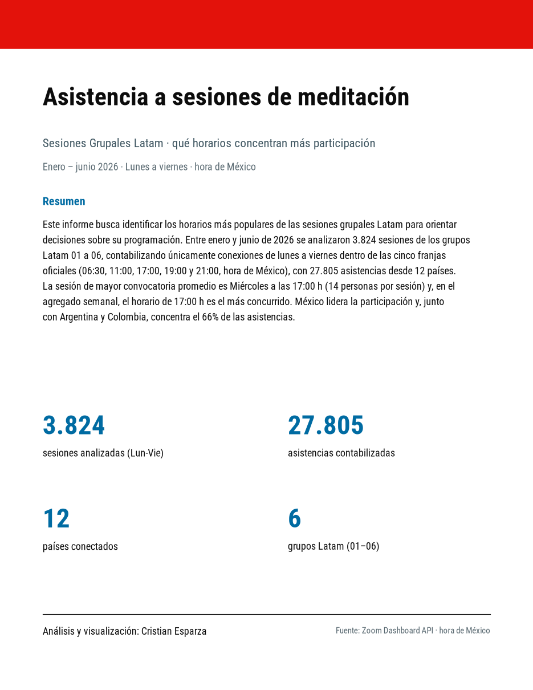
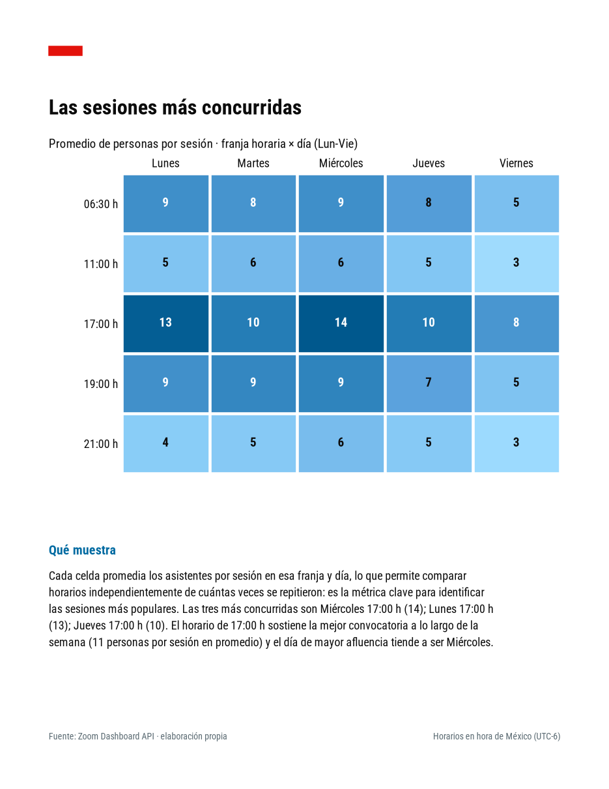
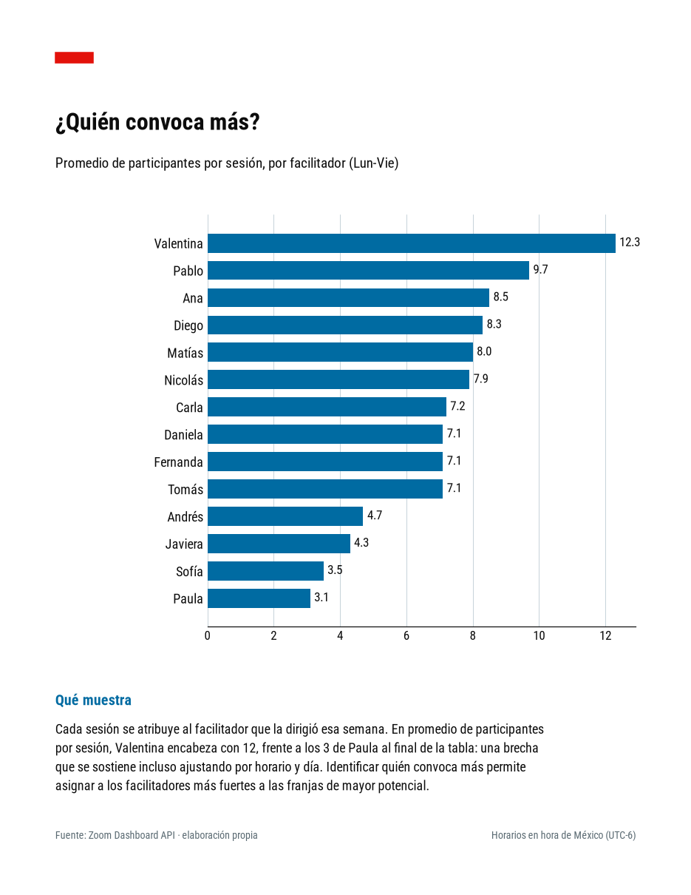

# Zoom Attendance Analytics

A Python pipeline that extracts attendance to recurring online group sessions
from the **Zoom Dashboard API**, models the messy real-world data, and produces
an **editorial (*The Economist*-style) PDF report** on session timing,
geography and facilitator performance.

The analysis answers operational questions: **which time slots draw the most
people, where participants connect from, and which facilitators convene the
largest groups** — to inform scheduling and staffing decisions.

> ⚠️ **Demo data.** This public repository runs on **synthetic data**
> (`src/make_synthetic_data.py`, fixed seed) and **fictional facilitator
> names**. No real participant, client or operational data is included. The
> code is the real engineering; the numbers are illustrative.

---

## The report

<p>
  
  
  
</p>

5 pages, all in *The Economist* visual style (red tag, condensed type, official
palette, equal-lightness sequential heatmaps):

1. **Cover** — executive summary + key indicators.
2. **Most-attended sessions** — heatmap of average attendees per session (time × weekday).
3. **Where the flow concentrates** — heatmap of total accumulated attendance.
4. **Country breakdown** — attendance by country.
5. **Who draws the most?** — average participants per session by facilitator.

---

## What it does

1. **Extract** every past meeting in a date range and, per meeting, its
   participant connections (join time, location/country, display name).
2. **Time-zone handling** — Zoom returns UTC; the pipeline converts to Mexico
   time (session schedule) and Chile time (local filters), handling DST.
3. **Aggregate** attendance by session, weekday, time slot and country,
   de-duplicating people within each session (rooms restart several times a day).
4. **Analyze** — busiest time slots, geography, participant level composition
   (N1–N7, CE, CF parsed from display-name tags), and per-facilitator
   convening power (attributed week-by-week to the facilitator on duty).
5. **Report** — a 5-page PDF built entirely with matplotlib.

## Pipeline

```
                 Zoom Dashboard API
                        │
                        ▼
        extract_latam_sessions.py  ──►  data/…_raw.csv
        (+ topup_latam_sessions.py: refills meetings missed on token expiry)
                        │
   ┌────────────────────┼─────────────────────┐
   ▼                    ▼                     ▼
 analyze_…           niveles_split.py     facilitadores.py
 (slots, country,    (level composition)  (per-facilitator,
  heatmaps)                                week-by-week attribution)
   └────────────────────┴──────────┬──────────┘
                                    ▼
                          economist_report.py
                                    ▼
                        reports/informe_latam.pdf

  (demo: src/make_synthetic_data.py replaces the API extraction step)
```

## Repository structure

```
.
├── src/
│   ├── paths.py                     # Centralized paths
│   ├── make_synthetic_data.py       # DEMO data generator (seeded)
│   ├── extract_zoom_participants.py # Zoom S2S OAuth client + per-country export
│   ├── extract_latam_sessions.py    # Raw connection dump from the API
│   ├── topup_latam_sessions.py      # Refill on token expiry (auto-refresh)
│   ├── analyze_latam_sessions.py    # Slot/day/country aggregation + heatmaps
│   ├── niveles_split.py             # Participant level composition
│   ├── facilitadores.py             # Per-facilitator ranking (3 views)
│   ├── horario_grids.py             # Weekly facilitator grids (fictional names)
│   └── economist_report.py          # The Economist–style PDF
├── fonts/                           # Roboto Condensed (Apache 2.0)
├── reports/informe_latam.pdf        # Sample report (demo data)
├── images/                          # Report screenshots
├── data/   (gitignored)             # Generated CSVs
└── requirements.txt
```

## Run it

```bash
python -m venv .venv && source .venv/bin/activate
pip install -r requirements.txt

# 1. Generate demo data (no API/credentials needed)
python src/make_synthetic_data.py

# 2. Analyze + report
python src/analyze_latam_sessions.py
python src/facilitadores.py
python src/niveles_split.py          # optional: level composition
python src/economist_report.py       # → reports/informe_latam.pdf
```

To run against real Zoom data instead of the demo generator: configure `.env`
(see `.env.example`) and run `src/extract_latam_sessions.py` — a Server-to-Server
OAuth app with `dashboard:read:list_meetings:admin` and
`dashboard:read:list_meeting_participants:admin` scopes is required.

## Methodology notes

- **Session** = (group, date, time slot). People are de-duplicated within each
  session because rooms restart multiple times a day.
- **Slot window**: a connection counts for a slot if its join time falls within
  `[start − 10 min, start + 60 min]` (1-hour sessions).
- **Facilitators**: each session is attributed to whoever was on duty that week,
  from the schedule grids; weeks with no new grid keep the previous one.
- **Robustness**: facilitators with fewer than 30 sessions are flagged as
  non-robust samples.

## Stack

Python · pandas · matplotlib · requests · Zoom Dashboard API.
Report typeface: Roboto Condensed (free stand-in for Econ Sans).
